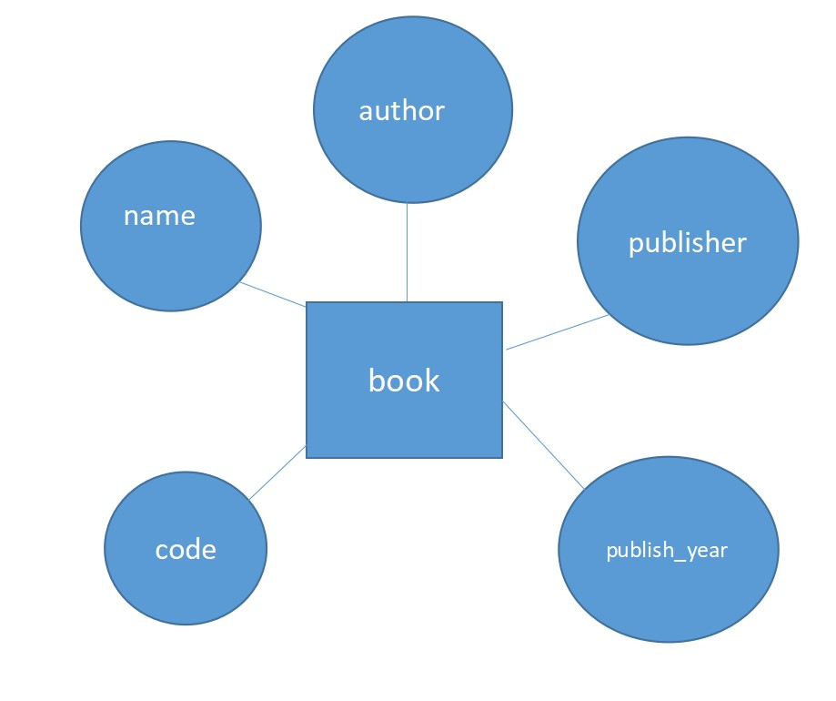

# Ex02 Django ORM Web Application
## Date: 28.02.2024

## AIM
To develop a Django application to store and retrieve data from a Book database using Object Relational Mapping(ORM).

## Entity Relationship Diagram



## DESIGN STEPS

### STEP 1:
Clone the problem from GitHub

### STEP 2:
Create a new app in Django project

### STEP 3:
Enter the code for admin.py and models.py

### STEP 4:
Execute Django admin and create details for 10 books

## PROGRAM

```
models.py

from django.db import models
from django.contrib import admin
class book(models.Model):
	name=models.CharField(max_length=20);
	author=models.CharField(max_length=20);
	publisher=models.CharField(max_length=20);
	publish_year=models.IntegerField();
	code=models.CharField(max_length=20,primary_key=True);
	price=models.IntegerField();
class bookAdmin(admin.ModelAdmin):
	list_display=("name","author","publisher","publish_year","code","price");

admin.py

from django.contrib import admin
from.models book,bookAdmin
admin.site.register(book,bookAdmin)
	
```

## OUTPUT


## RESULT
Thus the program for creating a database using ORM hass been executed successfully
